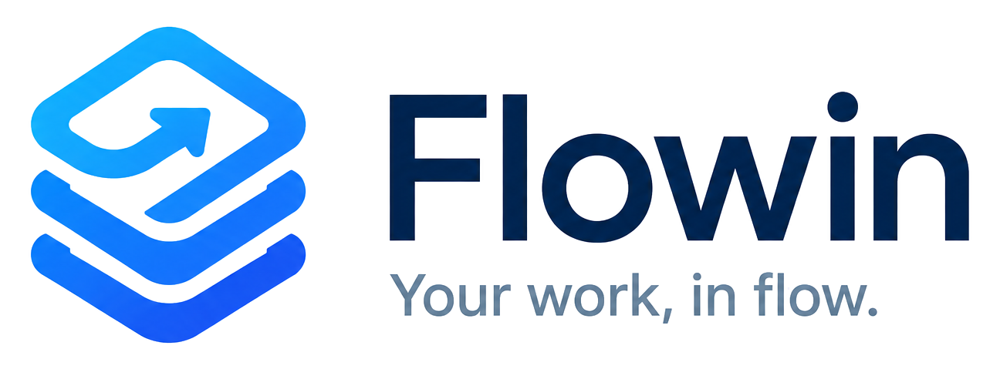
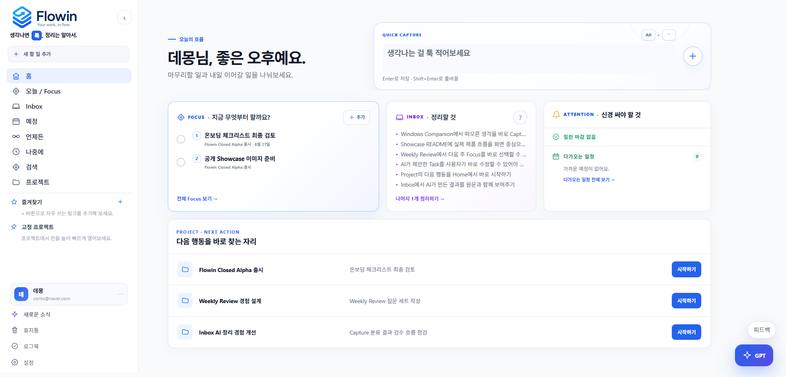
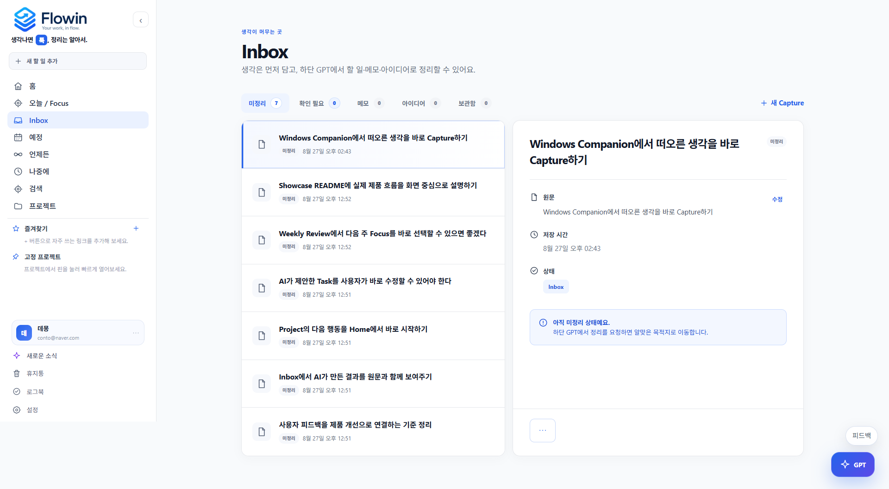
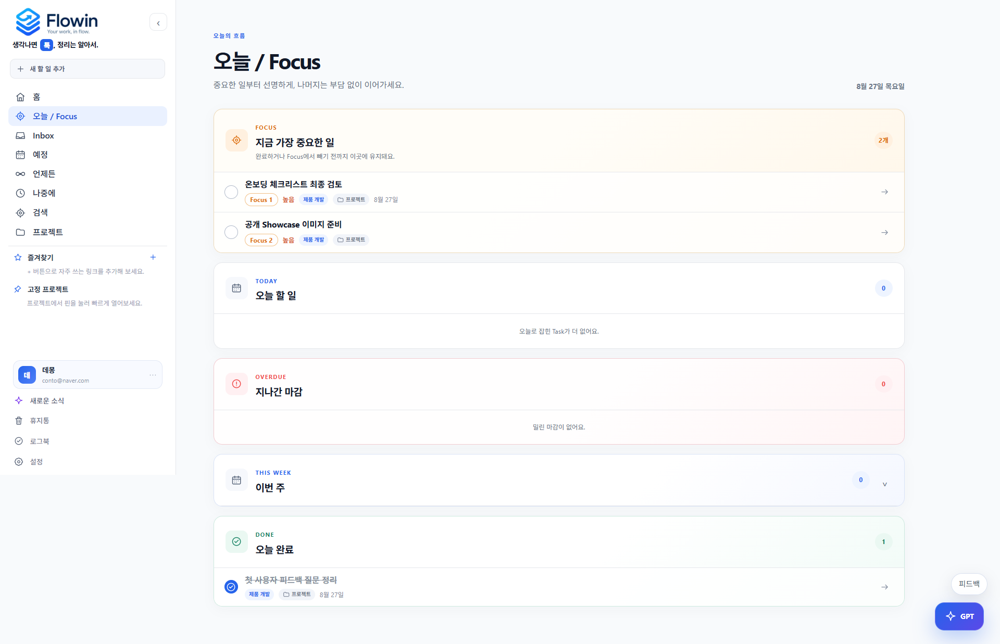
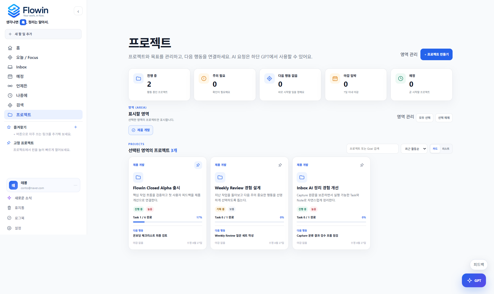
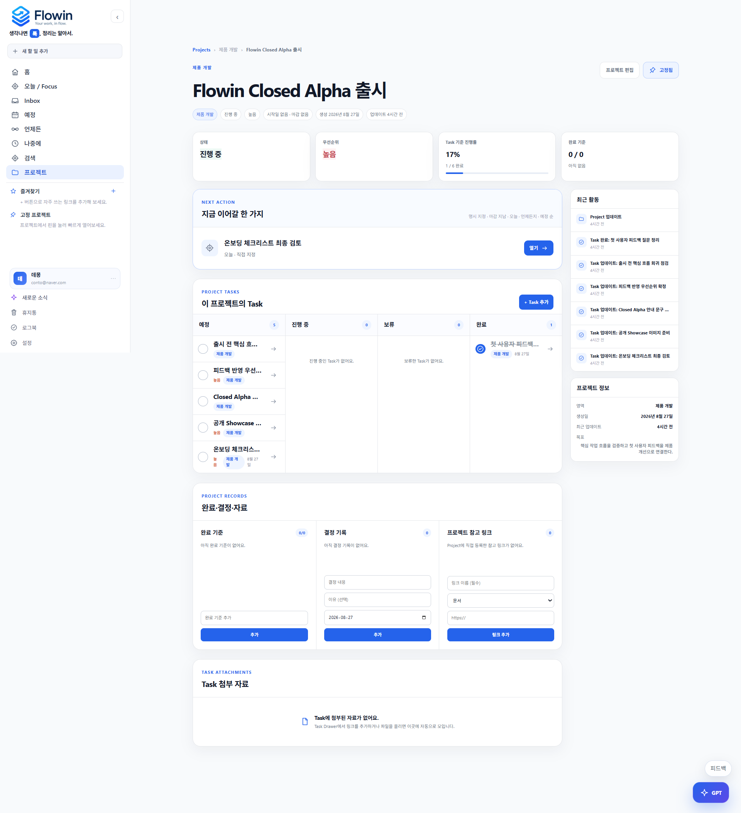
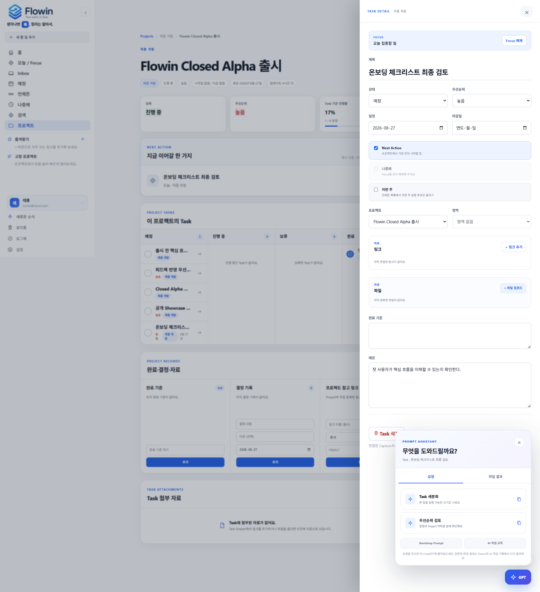

<p align="center">
  
</p>

# Flowin

> **생각나면 툭. 정리는 알아서.**

Flowin은 생각나는 내용을 가볍게 기록하고, 이를 실행 가능한 작업으로 정리해 **지금 무엇을 해야 하는지에 집중할 수 있게 만드는 AI-assisted personal work system**입니다.

이 저장소는 Flowin의 **공개 제품 쇼케이스**입니다. 실제 제품 소스코드는 비공개 저장소에서 관리하며, 여기서는 제품 문제 정의, 핵심 기능, UX 흐름, 아키텍처, 제품 의사결정과 발전 과정을 공개합니다.

| Product status | Current phase | Latest major update |
| --- | --- | --- |
| **Closed Alpha** | **Active Dogfooding / Iteration** | **Project Hub v0.2 · 2026-09-06** |

> Core product flow는 실제 사용 가능한 상태이며, 새로운 기능을 무조건 늘리기보다 **실제 사용·dogfooding·사용자 피드백에서 반복되는 마찰을 발견하고 개선하는 방식**으로 발전시키고 있습니다.

---

## Why Flowin?

할 일 관리 도구는 기록 자체보다 기록 이후의 작은 판단을 반복해서 요구할 때가 있습니다.

- 이건 어떤 프로젝트에 넣어야 하지?
- 우선순위는 어떻게 정하지?
- 날짜를 지금 결정해야 하나?
- 메모인가, 할 일인가?
- 그래서 지금 가장 먼저 해야 하는 건 뭔가?

Flowin은 이런 **반복적인 판단 비용을 줄이는 것**에서 시작했습니다.

```text
생각남
  ↓
Quick Capture
  ↓
Inbox
  ↓
AI 정리
  ↓
Today / Focus
  ↓
실행
  ↓
완료 / Logbook
```

---

## Latest Product Updates

Flowin은 실제 사용과 Closed Alpha 피드백을 기준으로 제품을 반복 개선하고 있습니다.

### 2026-09-06 · Project Hub v0.2

Project를 단순 Task 묶음에서 **실행·계획·기록이 연결되는 작업 Hub**로 확장했습니다.

- `개요 / 작업 / 기록` 3영역으로 Project 상세 IA 재설계
- Attention과 Next Action을 가장 먼저 보여주는 Overview
- Work에서 `List / Board / Timeline` 제공
- Workflow를 `Backlog → To Do → In Progress → Done`으로 정리
- `On Hold`는 정상 Workflow 밖의 예외 상태로 분리
- Timeline에서 Schedule / Task Deadline / Project Deadline을 서로 다른 의미로 표현
- `계획 필요`를 통해 실행 큐에 있지만 일정이 없는 Task를 바로 확인
- Records에서 완료 기준 / 결정 / 자료 / 활동을 분리해 관리
- 100-Task MRP Project 기준 dogfood audit 진행

### 2026-09-06 · Closed Alpha Feedback Round 4

Area archive/undo, GPT 미확인 결과 식별, 개인정보 동의 흐름, Project 재진입 로딩, Quick Capture 안내 등 실제 사용자 피드백을 반영했습니다.

### 2026-09-06 · Security & Operations Hardening

기준 국가, 해외 일반 Web 접근 보호, Security Activity, 실패 로그인 기록, Windows Companion/API 권한 경계와 보안 이벤트 보관 정책을 강화했습니다.

**[전체 Product Changelog 보기 →](docs/changelog.md)**

---

## Product Walkthrough

Flowin의 핵심 경험은 기능 목록이 아니라 하나의 작업 흐름으로 이어집니다.

### 1. Home — 오늘의 흐름을 바로 시작합니다



Quick Capture, Focus, Inbox와 프로젝트의 다음 행동을 한곳에서 확인합니다.

### 2. Inbox — 생각을 먼저 담고 나중에 정리합니다



입력할 때 분류를 요구하지 않고 원문을 보존합니다. AI가 만든 결과도 원문과 함께 검토하고 수정할 수 있습니다.

### 3. Today / Focus — 지금 중요한 일에 집중합니다



Focus, 오늘 할 일, 지난 마감과 완료 항목을 실행 순서에 맞게 보여줍니다.

### 4. Project Overview — 여러 프로젝트의 다음 행동을 비교합니다



상태와 진행률뿐 아니라 각 프로젝트에서 바로 시작할 Next Action을 함께 보여줍니다.

### 5. Project Hub — 실행, 계획, 기록을 한 맥락으로 연결합니다

Project 상세는 현재 `개요 / 작업 / 기록` 구조의 Project Hub로 확장되었습니다.

```text
Overview
└─ 지금 이 Project에서 무엇을 해야 하는가?

Work
├─ List
├─ Board
└─ Timeline
   └─ 어떻게 실행하고 계획할 것인가?

Records
├─ 완료 기준
├─ 결정
├─ 자료
└─ 활동
   └─ 왜 이렇게 진행되었고 무엇이 남아 있는가?
```



> 공개 스크린샷은 제품 변화에 맞춰 순차적으로 갱신합니다. 최신 Project Hub 구조와 변경 내역은 [Product Changelog](docs/changelog.md)에 기록합니다.

### 6. Task + GPT — 현재 작업 맥락을 AI 요청으로 이어갑니다



열려 있는 Task와 Project 맥락을 바탕으로 세분화, 우선순위 검토와 다음 행동 추천을 요청할 수 있습니다.

---

## Product Principles

- **Capture first** — 입력할 때 분류하지 않는다.
- **Separate capture from execution** — Capture와 Task를 분리한다.
- **AI as an organizing layer** — AI는 반복적인 정리와 판단을 줄이는 보조 레이어로 사용한다.
- **Execution over management** — Home과 Today에서는 관리보다 실행을 우선한다.
- **Recoverable AI** — AI가 틀려도 원문을 추적하고 쉽게 수정할 수 있어야 한다.
- **Usage-driven iteration** — 만들 수 있다는 이유보다 실제 사용에서 반복되는 문제를 우선한다.

---

## Core Experience

### Quick Capture & Inbox

생각나는 내용을 별도 분류 없이 바로 기록합니다. 원문을 보존하고, AI 또는 사용자가 이후 Task / Note / Idea 등으로 정리합니다.

### Today & Focus

오늘 실행해야 할 작업, Focus, 지난 마감, 이번 주 후보를 실행 중심으로 좁혀 보여줍니다.

### Project Hub

Project는 단순한 Task 묶음이 아니라 **“지금 무엇을 해야 하고, 어떻게 계획하며, 어떤 맥락이 남아 있는가?”**를 다룹니다.

- Overview: Attention / Next Action / 실행 현황 / Project context
- Work: List / Board / Timeline
- Workflow: Backlog / To Do / In Progress / Done + On Hold
- Planning: Schedule / Task Deadline / Project Deadline
- Records: Completion Criteria / Decisions / Resources / Activity

### Personal Work Hub

Sidebar Quick Links, Pinned Projects, Search, Logbook 등 자주 사용하는 실행 맥락에 빠르게 접근합니다.

### AI-assisted Organization

Flowin의 AI 기능은 단순 채팅보다 **사용자의 현재 작업 맥락을 정리하고 다시 제품으로 되돌려주는 구조**를 지향합니다.

```text
Flowin Context
    +
AI 작업 규칙
    +
사용자 요청
    ↓
AI Processing
    ↓
Task / Note / Project updates
    ↓
Flowin Activity / Traceability
```

---

## Product Architecture

현재 Flowin은 Next.js 기반 Web App, Supabase 기반 Data/Auth, AI integration, Windows Companion으로 구성되어 있습니다.

```text
┌──────────────────────────────┐
│          Flowin UI           │
│   Next.js / React / TS       │
└──────────────┬───────────────┘
               │
               ▼
┌──────────────────────────────┐
│     Application Services     │
│ Capture / Task / Project     │
│ Search / AI / Logbook        │
└──────────────┬───────────────┘
               │
               ▼
┌──────────────────────────────┐
│       Domain / Repository    │
└──────────────┬───────────────┘
               │
               ▼
┌──────────────────────────────┐
│      Data / Auth Layer       │
│ Supabase / PostgreSQL / RLS  │
└──────────────────────────────┘
```

초기 버전은 Notion API를 데이터 소스로 빠르게 검증했고, 실제 사용자 확장 단계에서 Supabase 기반 구조로 전환했습니다.

**[Architecture 자세히 보기 →](docs/architecture.md)**

---

## Tech Stack

| Area | Stack |
| --- | --- |
| Frontend | Next.js · React · TypeScript |
| Data / Backend | Supabase · PostgreSQL · Auth · RLS |
| AI Integration | ChatGPT · MCP / Actions · Prompt-based workflows |
| Testing | Vitest · TypeScript Type Check · ESLint |
| Deployment | Vercel |
| Desktop | Windows Companion / Quick Capture |

---

## Development Journey

```text
Aug 2026
Product Foundation
Capture / Task / Today / Project
        ↓
Closed Alpha
Real-user feedback rounds
        ↓
Platform Foundation
Supabase / Auth / RLS / MCP / Windows Companion
        ↓
Security & Operations
Security Center / Access Protection / Retention
        ↓
Sep 2026
Project Hub v0.2
        ↓
Now
Closed Alpha · Active Dogfooding
```

Flowin은 완성 화면 한 번을 만드는 프로젝트보다 **문제 발견 → 구현 → 실제 사용 → 피드백 → 구조 재설계 → 운영 안정화**의 반복 과정을 보여주는 프로젝트입니다.

---

## Current Status

**Closed Alpha · Active Dogfooding / Iteration**

현재 핵심 제품 흐름과 운영 기반은 구현되어 있습니다.

- Capture → Inbox → AI 정리 → Task / Note 흐름
- Today / Focus / Planned / Calendar
- Project Hub v0.2
- Supabase multi-user / Authentication / RLS
- Admin / onboarding
- Search / Logbook
- MCP / ChatGPT integration
- Windows Companion / Microsoft Store 배포
- Security Center 및 운영 보안 baseline

이제는 기능 수를 늘리는 단계보다 **실제 사용 중 반복해서 드러나는 불편, 버그, 신뢰성 문제를 우선적으로 개선**하는 단계입니다.

---

## Roadmap

Roadmap은 기능 약속 목록보다 현재 제품 단계와 개선 원칙을 중심으로 관리합니다.

### Now

- 직접 사용과 Closed Alpha dogfooding
- 실제 사용에서 발견되는 반복 마찰 개선
- 회귀 버그 / 신뢰성 / UX polish
- 보안·운영 baseline 유지
- 제품 화면과 공개 showcase 지속 갱신

### Exploration

Weekly Review, richer AI assistance, Semantic Search / RAG, Personalized Agent 등은 실제 사용 필요성이 확인될 때 우선순위를 정합니다.

**[Public Roadmap 보기 →](docs/roadmap.md)**

---

## Product Decisions

Flowin은 구현 결과뿐 아니라 **왜 그렇게 설계했는지**도 제품 산출물로 기록합니다.

- Capture와 Task를 분리한 이유
- AI 자동화에서 원문을 남기는 이유
- Notion prototype에서 Supabase multi-user 구조로 전환한 이유
- Project를 Task container가 아니라 실행·계획·기록 Hub로 확장한 이유
- Next Action을 workflow status와 분리한 이유
- 실제 사용에서 반복되는 문제를 우선하는 이유

**[Product Decisions 보기 →](docs/product-decisions.md)**

---

## Showcase Structure

```text
flowin-showcase/
├── README.md
├── docs/
│   ├── product-overview.md
│   ├── architecture.md
│   ├── product-decisions.md
│   ├── roadmap.md
│   └── changelog.md
└── assets/
    ├── brand/
    ├── screenshots/
    └── diagrams/
```

이 공개 저장소에는 소스코드 대신 **제품을 이해하는 데 필요한 정보, 시각 자료, 설계 판단과 변화 과정**을 중심으로 정리합니다.

---

## What this project demonstrates

- 문제 정의와 제품 기획
- UX / 정보 구조 설계
- Next.js 기반 Web Application 구현
- Supabase 기반 데이터 모델·인증·권한 구조
- AI 기능을 실제 제품 흐름에 통합하는 방법
- Windows Companion과 Web 제품의 연결
- 보안·운영 baseline 설계
- 사용자 피드백 기반 반복 개선
- 기능 확장과 복잡도 사이의 제품 의사결정
- 실제 사용 후 구조를 다시 설계하는 dogfooding 과정

---

## Public Showcase Notice

이 저장소는 **Flowin의 공개 포트폴리오 / 제품 쇼케이스**입니다.

- 실제 애플리케이션 소스코드는 비공개 저장소에서 관리합니다.
- 내부 환경 변수, 사용자 데이터, 운영 자격 증명과 보안 민감 구현은 공개하지 않습니다.
- 제품 화면과 문서는 공개 가능한 범위에서 지속적으로 업데이트합니다.

---

## Product Direction

Flowin이 궁극적으로 줄이고 싶은 것은 **할 일의 개수**가 아니라, 할 일을 관리하기 위해 사용자가 반복해서 내려야 하는 **작은 판단의 개수**입니다.

> **생각나면 툭.**  
> **정리는 알아서.**  
> **그리고 사용자는 실행에 집중한다.**
